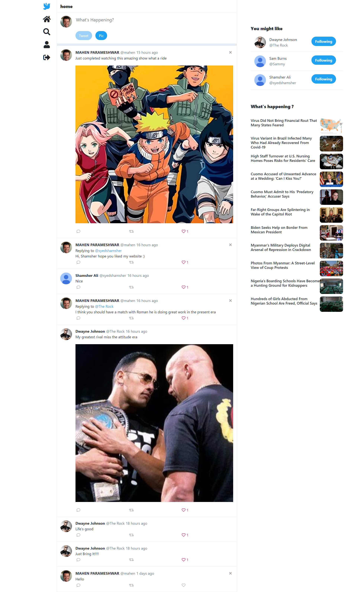

# TwitterCloneMERN

  Twitter is a social networking website which alows users to post messages and pictures and stay connected to the world.
 

 
 ## Features
 <ul>
  <li>The user can register and login  </li>
  <li>Can tweet pics captioned with text</li>
  <li>Can like, comment, and retweet</li>
  <li>Can view other users profile</li>
  <li>Can search for other users and tweets</li>
  <li>Can view the latest news around the world</li>
</ul>

## Tech Stack used:

<code></code>
<code></code>
<code></code>
<code></code>
<code></code>
<code></code>
<code></code>
<code></code>
<code></code>

## <code>Demo</code>

## <code>Home Page</code>

## <code>Profile Page</code>

### Installation and Setup Instructions

Clone down this repository. You will need node and npm installed globally on your machine. Installation: npm install To Run Test Suite: npm test To Start Server: npm run dev To Visit App: localhost:3000/

### Api's Used
 <ul>
  <li>Clodinary</li>
  <li>Nytimes</li>
 </ul>

## Tech Library used:
  <ul>
  <li>React APP</li>
  <li>Axios</li>
  <li>Material UI</li>
<li>bcrypt</li>
<li>bcryptjs</li>
<li>concurrently</li>
<li>cors</li>
<li>dotenv</li>
<li>express</li>
<li>joi</li>
<li>jsonwebtoken</li>
<li>mongoose</li>
<li>razorpay</li>
<li>react-router-dom</li>
<li>request</li>
<li>uuid</li>
  <li>@fortawesome/fontawesome-svg-core</li>
    <li>@fortawesome/free-solid-svg-icons</li>
    <li>@fortawesome/react-fontawesome</li>
    <li>email-validator</li>
    <li>Bootstrap</li>
    <li>react</li>
    <li>react-debounce-input</li>
    <li>react-dom</li>
    <li>react-elastic-carousel</li>
    <li>react-icons</li>
    <li>react-modal</li>
    <li>react-redux</li>
    <li>react-router-dom</li>
    <li>react-scripts</li>
    <li>redux</li>
    <li>redux-devtools-extension</li>
    <li>redux-thunk</li>
  </ul>

